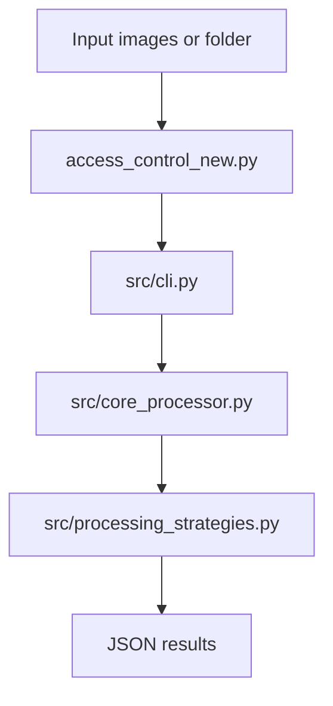

# Access Control Policy — DAG Images to Knowledge Graphs

**Model-agnostic vision-LLM pipeline** that turns Access Control DAG images into structured knowledge-graph outputs (entities, relation classification, or end-to-end extraction) using OpenAI-compatible vision models.

This README follows a clear, repository-first layout (similar in spirit to projects like [LogosKG](https://github.com/Serendipity618/LogosKG-Efficient-and-Scalable-Graph-Retrieval)) so you can **install → configure → run** in a few steps.

---

## Overview

- **Input:** PNG/JPEG (or folders of images) depicting access-control graphs.
- **Output:** JSON under your chosen output directory (default layout described below).
- **Backend:** OpenAI API (`openai` Python SDK) with optional `.env` loading via `python-dotenv`.

**Entry point:** [`access_control_new.py`](access_control_new.py) → [`src/cli.py`](src/cli.py) → [`src/core_processor.py`](src/core_processor.py) → [`src/processing_strategies.py`](src/processing_strategies.py).



---

## Features

| Mode (`--method`) | Purpose |
|-------------------|---------|
| `extract_entities` | Detect graph **nodes** (entities) from the image. |
| `relation_classification` | **Binary** relation checks using entity pairs (from ground-truth JSON or prior predictions). |
| `relation_extraction` | **End-to-end:** nodes + edges / paths from the image (user-facing name; internally mapped to `path_generation`). |

**Additional methods** (same CLI; for experiments or advanced flows): `extract_relation`, `enumerate_paths`, `path_generation`.

---

## Requirements

- **Python:** 3.10+ recommended (uses **Pydantic v2**).
- **Network:** calls to OpenAI’s API.
- **Data:** place datasets under `datasets/` if you use the default `--input` (see [Dataset layout](#dataset-layout)).

---

## Installation

From the repository root (`Access-Control-Policy/`):

```bash
cd /path/to/Access-Control-Policy

python3 -m venv .venv
source .venv/bin/activate   # Windows: .venv\Scripts\activate

pip install -r requirements.txt
```

---

## Configuration (use placeholders for secrets)

1. Copy the example environment file and **edit with your real key** (never commit real values):

   ```bash
   cp .env.example .env
   ```

2. Open `.env` and set:

   ```bash
   OPENAI_API_KEY="<OPENAI_API_KEY>"
   ```

   Replace `<OPENAI_API_KEY>` with your actual key. For documentation or screenshots, use placeholders only:

   - `<YOUR_NAME>`, `<YOUR_ORG>`, `<YOUR_EMAIL>`
   - `<OPENAI_API_KEY>`, `<AZURE_OPENAI_API_KEY>` (if you extend the code for Azure)
   - `<MODEL_NAME>`, `<DATASET_PATH>`, `<OUTPUT_PATH>`

3. Optional: limit resize side (see [`src/config.py`](src/config.py)):

   ```bash
   MAX_IMAGE_SIDE="2048"
   ```

---

## Quick start

Run from the **project root** so `src/` imports resolve.

**1) Entity extraction (default method, default input `datasets/`)**

```bash
export OPENAI_API_KEY="<OPENAI_API_KEY>"
python access_control_new.py --method extract_entities
```

**2) Relation classification (ground-truth entities from JSON folder)**

```bash
export OPENAI_API_KEY="<OPENAI_API_KEY>"
python access_control_new.py \
  --input "<DATASET_PATH>/SubgraphsWithTriplesImages/subgraphs_01" \
  --output "<OUTPUT_PATH>/relation_classification/subgraphs_01" \
  --entities_input "<DATASET_PATH>/SubgraphsWithTriplesJSON/subgraphs_01" \
  --method relation_classification \
  --relation_source ground_truth \
  --model gpt-5-nano \
  --image_detail low
```

**3) End-to-end relation extraction (image → nodes + edges)**

```bash
export OPENAI_API_KEY="<OPENAI_API_KEY>"
python access_control_new.py \
  --input "<DATASET_PATH>/SubgraphsWithTriplesImages/subgraphs_01" \
  --output "<OUTPUT_PATH>/relation_extraction/subgraphs_01" \
  --method relation_extraction \
  --model gpt-5-nano \
  --image_detail high \
  --few_shot zero
```

**4) Images without legend**

```bash
python access_control_new.py \
  --input "<DATASET_PATH>/SubgraphsWithTriplesImages/subgraphs_06_wo_legend" \
  --output "<OUTPUT_PATH>/relation_extraction/subgraphs_06_wo_legend" \
  --no_legend \
  --method relation_extraction
```

**5) Full CLI help (ground truth for options)**

```bash
python access_control_new.py --help
```

---

## Defaults and output paths

| Option | Default | Notes |
|--------|---------|--------|
| `--input` | `datasets/` (project `datasets` directory) | File or directory. |
| `--output` | `experiments/` | For **directory** input, if you keep this default, results go under `experiments/<method>/<input_folder_name>/`. |
| `--method` | `extract_entities` | |
| `--few_shot` | `zero` | Use `few` for Context7-style few-shot (requires few-shot assets in repo). |
| `--relation_source` | `ground_truth` | For `relation_classification`: `predicted` uses prior `extract_entities` outputs. |
| `--image_detail` | `low` | `high` = higher cost/quality. |
| `--workers` | `4` | Use `1` for sequential runs. |
| `--model` | `gpt-5-nano` | Choices: `gpt-5-nano`, `gpt-5-mini`, `gpt-4o-mini`, `gpt-4o`. |

Replace model with your chosen slug, e.g. `--model <MODEL_NAME>`.

---

## Dataset layout

If you use the **SubgraphsWithTriples** layout:

**Images (`--input`):**

- `datasets/SubgraphsWithTriplesImages/subgraphs_01`
- `datasets/SubgraphsWithTriplesImages/subgraphs_001`
- `datasets/SubgraphsWithTriplesImages/subgraphs_01_wo_legend`
- `datasets/SubgraphsWithTriplesImages/subgraphs_001_wo_legend`
- `datasets/SubgraphsWithTriplesImages/subgraphs_06`
- `datasets/SubgraphsWithTriplesImages/subgraphs_06_wo_legend`

**Ground-truth JSON (auto-resolved or via `--entities_input` / `--gt_input`):**

- `datasets/SubgraphsWithTriplesJSON/subgraphs_01` — pairs with `subgraphs_01` and `subgraphs_01_wo_legend`
- `datasets/SubgraphsWithTriplesJSON/subgraphs_001` — pairs with `subgraphs_001` and `subgraphs_001_wo_legend`
- `datasets/SubgraphsWithTriplesJSON/subgraphs_06` — pairs with `subgraphs_06` and `subgraphs_06_wo_legend`

---

## CLI reference

| Argument | Description |
|----------|-------------|
| `--input` | Image file or folder. |
| `--output` | Output file (single image) or directory. |
| `--entities_input` | For `relation_classification`: entities source folder (GT JSON dir or predicted entities dir). |
| `--gt_input` | Optional explicit ground-truth directory for evaluation. |
| `--with_legend` / `--no_legend` | Legend handling (default: with legend). |
| `--method` | `extract_entities`, `relation_classification`, `relation_extraction`, `extract_relation`, `enumerate_paths`, `path_generation`. |
| `--few_shot` | `zero` or `few`. |
| `--relation_source` | `ground_truth` or `predicted`. |
| `--subset_size` | Optional: limit to N random relations per graph (testing). |
| `--comprehensive_eval` | Flag: broader evaluation mode. |
| `--fuzzy_matching` | Flag: fuzzy entity matching in evaluation. |
| `--image_detail` | `low` or `high`. |
| `--workers` | Parallel workers for batch processing. |
| `--model` | Vision model (see defaults table). |

---

## Project structure (high level)

| Path | Role |
|------|------|
| [`access_control_new.py`](access_control_new.py) | Main entry; can run with no args (programmatic defaults) or full CLI. |
| [`src/cli.py`](src/cli.py) | Argument parsing and orchestration. |
| [`src/config.py`](src/config.py) | Paths, defaults, `APIConfig` / `ProcessingConfig`. |
| [`src/core_processor.py`](src/core_processor.py) | Batch and single-file processing. |
| [`src/processing_strategies.py`](src/processing_strategies.py) | Vision LLM strategies. |
| [`requirements.txt`](requirements.txt) | Python dependencies. |
| [`.env.example`](.env.example) | Template for secrets (placeholders only). |

---

## Troubleshooting

- **`OpenAI API key not provided`** — Set `OPENAI_API_KEY` in `.env` or the environment (see [Configuration](#configuration-use-placeholders-for-secrets)).
- **Import errors** — Run commands from the **repository root**; ensure `pip install -r requirements.txt` completed.
- **Wrong output location** — For directory inputs, the CLI may rewrite `--output` when it equals the default `experiments/`; set `--output` explicitly to control the path.

---

## Security

- Do **not** commit `.env`, API keys, or internal dataset paths that identify individuals.
- Use placeholders in docs, issues, and PRs: `<OPENAI_API_KEY>`, `<YOUR_NAME>`, etc.
- `.env` is listed in [`.gitignore`](.gitignore).

---

## License

Add your license here (e.g. MIT). If this repository is for a paper, add a **Citation** block with your DOI or arXiv/medRxiv link.

---

## Citation (optional)

If you publish this work, use a BibTeX block with your real metadata (replace placeholders):

```bibtex
@misc{<YOUR_CITATION_KEY>,
  title={Your Paper Title},
  author={<YOUR_NAME> and colleagues},
  year={2026},
  howpublished={\url{https://example.org/your-article}}
}
```
