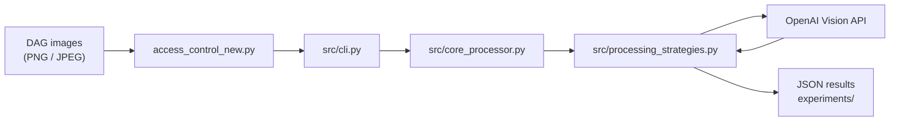

# Access Control Policy: DAG-to-Knowledge-Graph Extraction

Python 3.10+ | License: MIT | Backend: OpenAI Vision API

**Access Control Policy** is a model-agnostic pipeline that converts **Access Control DAG images** into structured knowledge graphs using OpenAI-compatible vision models. Given an image of a directed acyclic graph depicting users, resources, and policies, the system extracts entities, classifies relations, or performs end-to-end graph reconstruction.

### Authors & Affiliations

1. **<YOUR_NAME>**, <YOUR_ORG>
2. _(add co-authors here)_

---

## Overview



The pipeline supports three primary modes:

| Mode (`--method`) | What it does |
|---|---|
| `extract_entities` | Identify **nodes** (users, objects, policy classes) from the image. |
| `relation_classification` | **Binary** relation check for each entity pair (requires entity list). |
| `relation_extraction` | **End-to-end:** extract nodes + edges from the image in one pass. |

Additional experimental methods (`enumerate_paths`, `path_generation`, `extract_relation`) are also available via the CLI.

---

## Data Format

**Input:** PNG or JPEG images of Access Control DAG graphs.  
Images can include or exclude a legend (`--with_legend` / `--no_legend`).

**Output:** JSON files containing extracted entities, classified relations, or full knowledge graphs, saved under the output directory.

**Dataset layout** (when using the bundled SubgraphsWithTriples data):

```
datasets/
  SubgraphsWithTriplesImages/        # --input points here
    subgraphs_01/
    subgraphs_001/
    subgraphs_06/
    subgraphs_01_wo_legend/
    subgraphs_001_wo_legend/
    subgraphs_06_wo_legend/
  SubgraphsWithTriplesJSON/          # ground-truth (auto-resolved)
    subgraphs_01/                    # GT for subgraphs_01 + subgraphs_01_wo_legend
    subgraphs_001/                   # GT for subgraphs_001 + subgraphs_001_wo_legend
    subgraphs_06/                    # GT for subgraphs_06 + subgraphs_06_wo_legend
```

> Place your own images in `datasets/` or pass an explicit `--input` path.

---

## Installation

```bash
git clone https://github.com/<YOUR_ORG>/Access-Control-Policy.git
cd Access-Control-Policy

python3 -m venv .venv
source .venv/bin/activate        # Windows: .venv\Scripts\activate

pip install -r requirements.txt
```

**Dependencies** (see [`requirements.txt`](requirements.txt)):

- `openai` >= 1.0
- `pydantic` >= 2.0
- `python-dotenv` >= 1.0
- `Pillow` >= 10.0

---

## Configuration

Copy the example environment file and fill in your API key:

```bash
cp .env.example .env
```

Edit `.env`:

```bash
OPENAI_API_KEY="<OPENAI_API_KEY>"
```

> **Security:** `.env` is in `.gitignore`. Never commit real API keys.  
> Use placeholders (`<OPENAI_API_KEY>`, `<YOUR_NAME>`, etc.) in documentation and pull requests.

---

## Quick Start

### 1. Entity Extraction (default)

```bash
python access_control_new.py --method extract_entities
```

### 2. Relation Classification

```bash
python access_control_new.py \
  --input datasets/SubgraphsWithTriplesImages/subgraphs_01 \
  --output experiments/relation_classification/subgraphs_01 \
  --entities_input datasets/SubgraphsWithTriplesJSON/subgraphs_01 \
  --method relation_classification \
  --relation_source ground_truth \
  --model gpt-5-nano --image_detail low
```

### 3. End-to-End Relation Extraction

```bash
python access_control_new.py \
  --input datasets/SubgraphsWithTriplesImages/subgraphs_01 \
  --output experiments/relation_extraction/subgraphs_01 \
  --method relation_extraction \
  --model gpt-5-nano --image_detail high --few_shot zero
```

### 4. No-Legend Images

```bash
python access_control_new.py \
  --input datasets/SubgraphsWithTriplesImages/subgraphs_06_wo_legend \
  --output experiments/relation_extraction/subgraphs_06_wo_legend \
  --no_legend --method relation_extraction
```

### 5. Batch Run (all datasets)

```bash
bash run_v1.sh
```

### 6. Full CLI Help

```bash
python access_control_new.py --help
```

---

## CLI Reference

| Argument | Default | Description |
|---|---|---|
| `--input` | `datasets/` | Image file or directory. |
| `--output` | `experiments/` | Output file or directory. |
| `--method` | `extract_entities` | Processing mode (see table above). |
| `--model` | `gpt-5-nano` | Vision model (`gpt-5-nano`, `gpt-5-mini`, `gpt-4o-mini`, `gpt-4o`). |
| `--image_detail` | `low` | `low` (cost-efficient, ~2.8k tokens) or `high` (~54k tokens). |
| `--few_shot` | `zero` | `zero` or `few` (Context7-style few-shot). |
| `--workers` | `4` | Parallel workers for batch processing (1 = sequential). |
| `--relation_source` | `ground_truth` | Entity source for `relation_classification`: `ground_truth` or `predicted`. |
| `--entities_input` | — | Entity folder for `relation_classification`. |
| `--gt_input` | — | Explicit ground-truth directory for evaluation. |
| `--with_legend` / `--no_legend` | with | Legend handling. |
| `--subset_size` | — | Limit to N random relations per graph (testing). |
| `--comprehensive_eval` | off | Broader evaluation across all possible relations. |
| `--fuzzy_matching` | off | Fuzzy entity name matching in evaluation. |

---

## Project Structure

```
Access-Control-Policy/
├── access_control_new.py        # Main entry point
├── run_v1.sh                    # Batch runner script
├── requirements.txt             # Python dependencies
├── .env.example                 # API key template (placeholders only)
├── .gitignore
├── README.md
└── src/                         # Core package
    ├── __init__.py
    ├── cli.py                   # Argument parsing and orchestration
    ├── config.py                # Constants, data models, configuration classes
    ├── core_processor.py        # Batch and single-file processing engine
    ├── processing_strategies.py # Vision-LLM strategy classes
    ├── access_prompt.py         # Prompt engineering and message builders
    ├── entity_pair_generator.py # Entity pair generator for relation classification
    ├── evaluation.py            # Evaluation metrics (micro/macro F1, CSV export)
    ├── eval_metric.py           # Standalone KG evaluation (strict/relaxed)
    └── file_utils.py            # File I/O, image encoding, JSON parsing
```

---

## Troubleshooting

| Problem | Solution |
|---|---|
| `OpenAI API key not provided` | Set `OPENAI_API_KEY` in `.env` or export it in your shell. |
| `ModuleNotFoundError: No module named 'src'` | Run from the **repository root** (`Access-Control-Policy/`). |
| Wrong output directory | Set `--output` explicitly; the default auto-nests under `experiments/<method>/`. |
| Truncated model responses | Increase `max_tokens` in `src/config.py` → `APIConfig`. |

---

## Security Notes

- **Never** commit `.env`, API keys, or paths that reveal personal information.
- Use these placeholders in all shared docs: `<OPENAI_API_KEY>`, `<YOUR_NAME>`, `<YOUR_ORG>`, `<YOUR_EMAIL>`.
- `.env` is listed in [`.gitignore`](.gitignore).

---

## License

_Add your license here (e.g., MIT)._ See the `LICENSE` file for details.

---

## Citation

```bibtex
@misc{<YOUR_CITATION_KEY>,
  title   = {Access Control Policy: DAG-to-Knowledge-Graph Extraction},
  author  = {<YOUR_NAME>},
  year    = {2026},
  url     = {https://github.com/<YOUR_ORG>/Access-Control-Policy}
}
```
